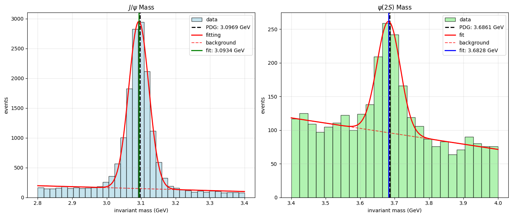

# Homework-for-statistic-course-measurement-of-$J/\psi$ invariant mass

The final test of the course:Statistics in Physics.The test comes form Dr. Zhou  at Wuhan University.

It contains a measurement of the invariant mass about $J/\psi$ and $\psi(2S)$ through CMS open data at https://raw.githubusercontent.com/cms-opendata-education/cms-jupyter-materials-english/master/Data/Jpsimumu_Run2011A.csv.

Thanks to Dr. Zhou.

